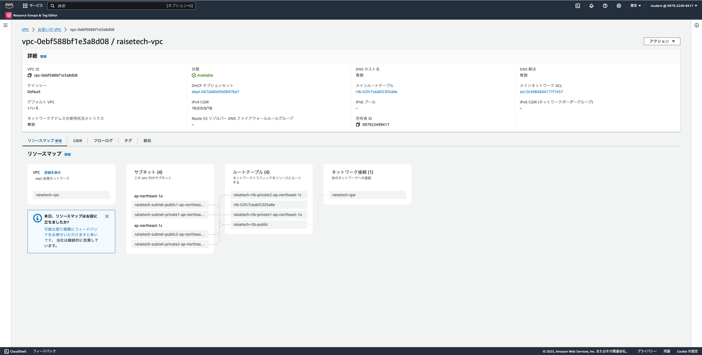
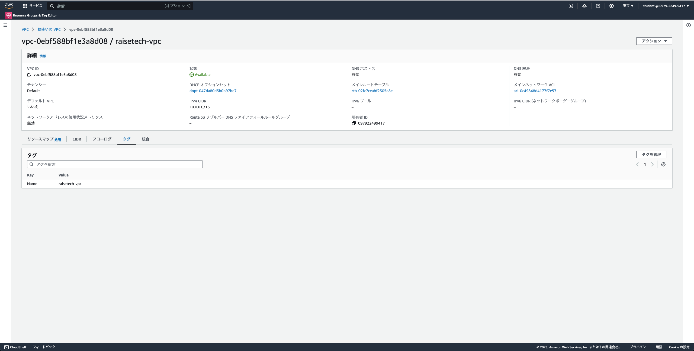
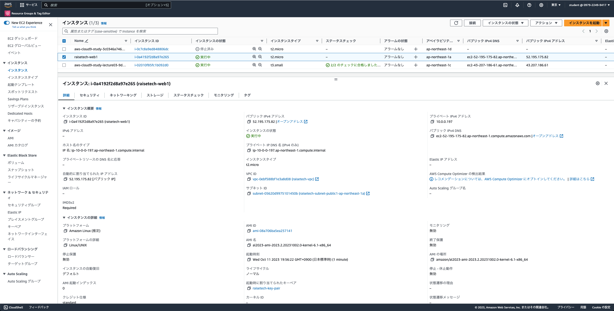
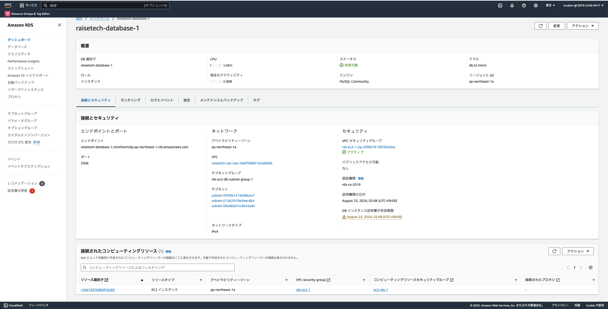
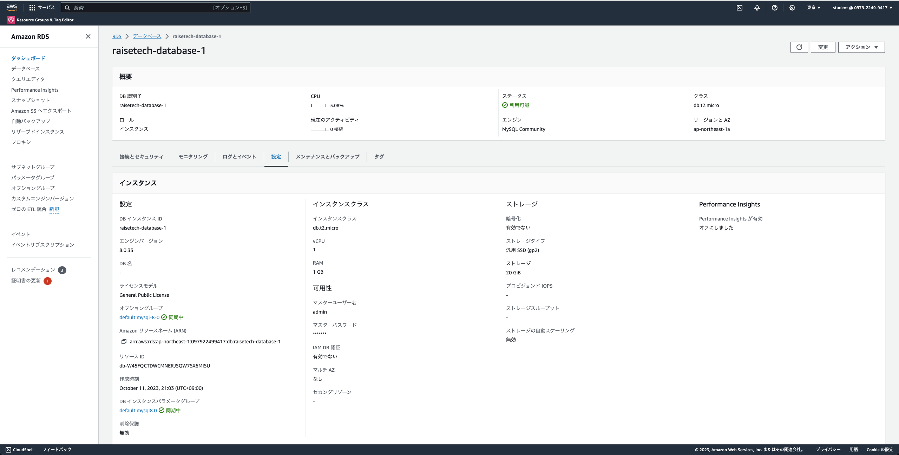
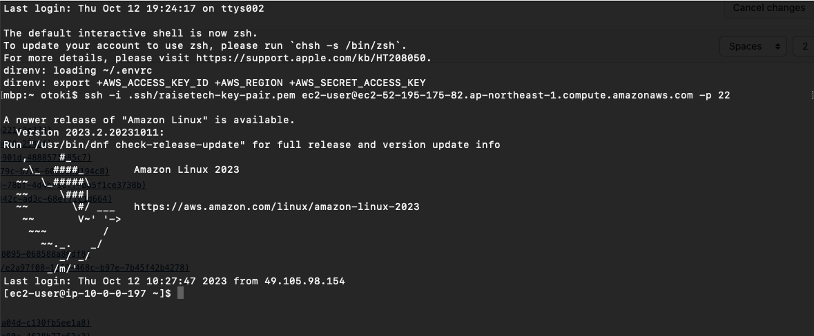
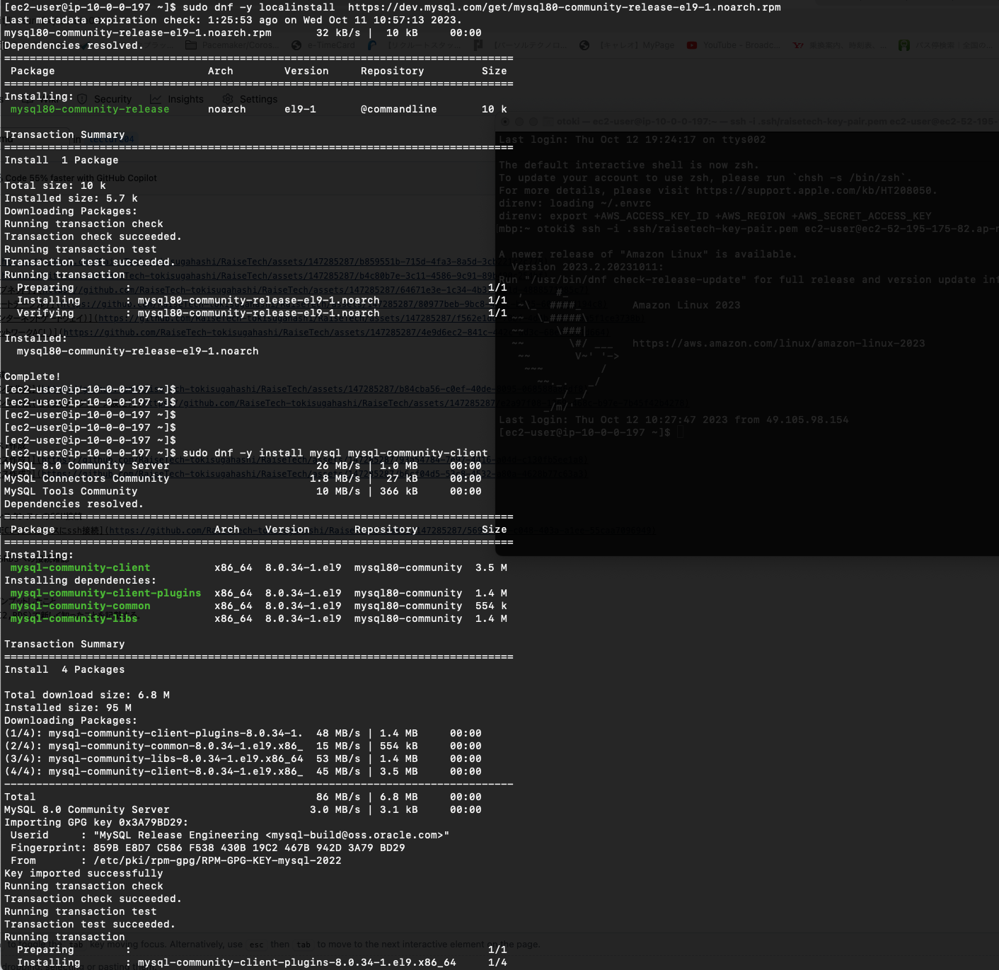
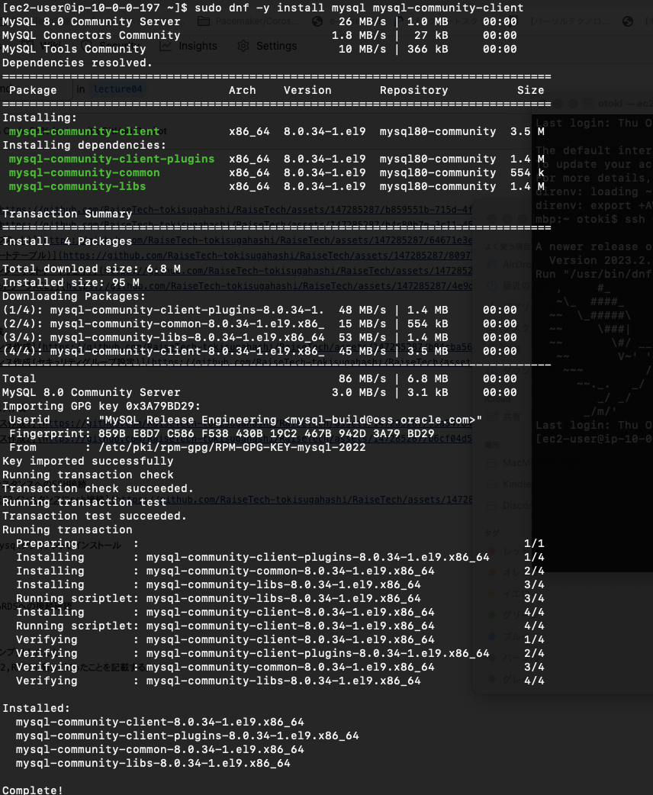
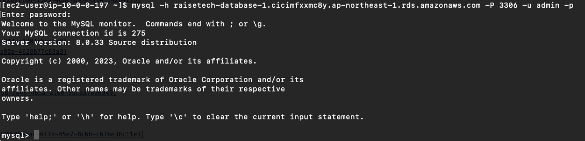

# 第四回講義  
## 作業証跡  

VPC作成  

.png)
.png)
.png)
.png)
  
  
EC2インスタンス作成  

.png)

  
RDS(DBインスタンス)作成  

  
  
ローカルからEC2インスタンスへのSSH接続  

  
  
EC2インスタンスにmysqlクライアントをインストール  

  
  
EC2インスタンスからRDSへの接続確認  

  

